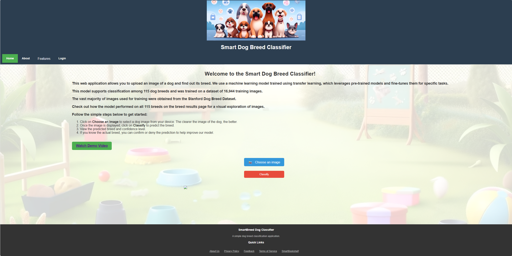
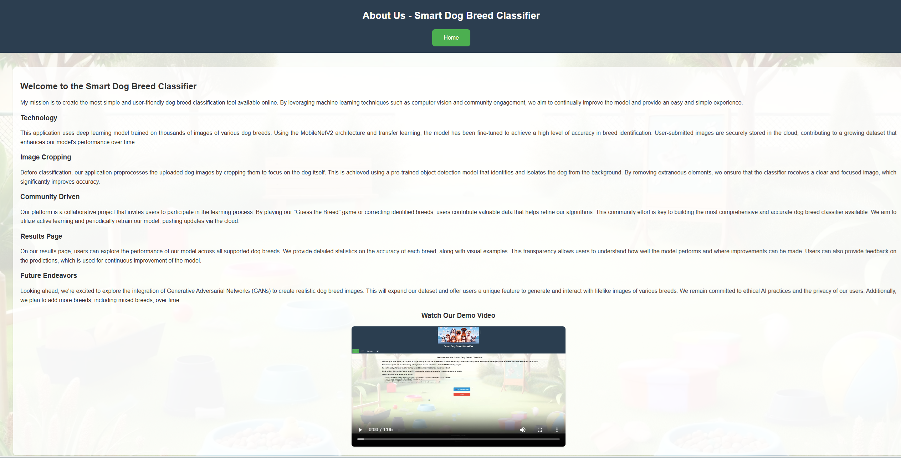
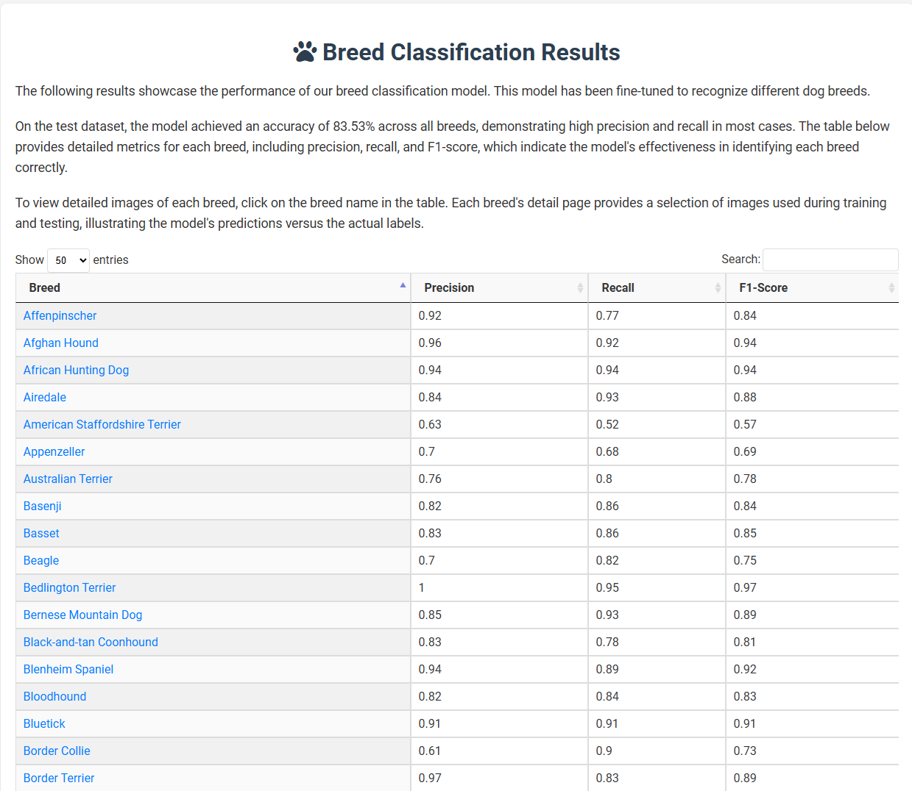

# SmartBreeds.io

AI-driven web application designed to accurately identify dog breeds from user-uploaded images. This comprehensive project integrates various advanced technologies and methodologies, including machine learning, deep learning, and web development frameworks, to deliver a seamless and interactive user experience.

Access it at https://smartbreed.io or click [here](https://smartbreeds.io)

This application is a deep learning model based on MobileNetV2, a powerful and efficient convolutional neural network optimized for speed and accuracy, making it ideal for real-time applications.

To enrich the user experience and functionality, SmartBreed incorporates features like user registration, login functionality, and a dynamic game where users can test their knowledge by identifying dog breeds, fostering user engagement and educational value. The application also includes a statistics page that provides insightful analytics on the model's performance, including accuracy, recall, and common misclassifications, allowing users to explore the data in-depth.

## Project Overview

This project demonstrates an integration of cloud technologies and machine learning within a web application. The core functionality allows users to upload images, which are then classified by a pre-trained machine learning model. Utilizing an active learning approach, the system continuously improves its accuracy by leveraging user feedback on predictions.

## Key Features

1. **Image Upload and Storage:** Users can upload images via a web interface. These images are stored in Google Cloud Storage, organized by user-provided labels, facilitating an organized dataset for model retraining.

2. **Machine Learning Model Integration:** The project incorporates a TensorFlow-based model, which classifies the uploaded images. The model, hosted on the cloud, can be accessed by the application for real-time predictions.

3. **SSD Model for Image Cropping:** Before classification, the images are processed using a Single Shot Multibox Detector (SSD) model to detect and crop the dog from the image. This ensures that the model focuses on the relevant part of the image, improving classification accuracy.

4. **Active Learning Cycle:** User feedback on the model's predictions is collected through the interface. This feedback informs the retraining process, enabling the model to adapt and improve over time.

5. **Cloud SQL Database:** User responses, along with the associated image metadata, are stored in a Cloud SQL database. This structured storage allows for efficient data retrieval and analysis, essential for the active learning process.

6. **Cloud SQL Proxy:** The application securely connects to the Cloud SQL database using the Cloud SQL Proxy, ensuring encrypted and authenticated database access.

7. **Automated Data Pipeline:** The project includes a data pipeline (in progress) that automatically updates the training dataset in response to new user uploads and feedback, preparing the data for subsequent model retraining cycles.

8. **OAuth Integration with Firebase:** Firebase Authentication is used to manage user authentication, allowing users to log in with Google, GitHub, or traditional email and password via Flask. This integration provides a seamless and secure login experience, leveraging Firebase's robust authentication mechanisms.

9. **HTTPS Domain:** The application is hosted on a secure HTTPS domain, ensuring encrypted communication between the client and the server. This enhances the security and privacy of user data.

## Technologies Used

- **Flask:** Serves as the web application framework.
- **Google Cloud Storage:** Hosts the uploaded images and organizes them based on user-provided labels.
- **TensorFlow:** Powers the machine learning model for image classification.
- **SSD Model:** Used for detecting and cropping dog images before classification.
- **Google Cloud SQL & Cloud SQL Proxy:** Manages user data and ensures secure access to the database.
- **Docker:** Containerizes the application, ensuring consistency across different environments.
- **Firebase Authentication:** Manages user authentication, supporting OAuth login with Google and GitHub.
- **HTTPS:** Ensures secure communication between the client and server.

## How It Works

1. Users upload images through the web interface, which are then stored in a designated Google Cloud Storage bucket.
2. The SSD model detects and crops the dog from the image to ensure focus on relevant features.
3. The TensorFlow model classifies the cropped images, and the predictions are displayed to the users.
4. Users provide feedback on the accuracy of the predictions, which is stored in the Cloud SQL database.
5. The feedback is utilized to periodically retrain the model, implementing an active learning loop that enhances the model's performance over time.

## Docker and Containerization

Docker is used extensively in this project to ensure consistency and portability across different environments. The application is containerized using Docker, which allows for easy deployment and scaling. Each component of the application, including the Flask web server, TensorFlow model, and Cloud SQL Proxy, is run in its own container. This modular approach ensures that each service is isolated and can be managed independently, improving reliability and maintainability.

### Benefits of Using Docker:

- **Consistency:** Ensures that the application runs the same way in development, testing, and production environments.
- **Isolation:** Each component runs in its own container, preventing conflicts and simplifying debugging.
- **Scalability:** Containers can be easily scaled up or down based on demand.
- **Portability:** Docker containers can run on any system that supports Docker, making it easy to move the application between different environments.

## Results Page:

## Future Enhancements

- Implement a more robust active learning framework to optimize the retraining cycle.
- Introduce additional features to the user interface to facilitate a more interactive feedback process.
- Expand the model's capabilities to classify a wider range of images or to improve its accuracy and efficiency.
- Develop an automated data pipeline for seamless model retraining.
- Introduce breed Quiz that will use a RAG.
- Work on GANs.

## Deployment and Scalability

Deployment and scalability have been key considerations in this project. The application is containerized using Docker, facilitating easy deployment and scaling across different environments. Designed to leverage cloud services for storage, computation, and hosting, SmartBreed ensures high availability and performance.

Bounding boxes were used on the initial training images to improve accuracy. This integration of bounding box annotations in the training process enhances the model's focus on relevant features within the images, thereby improving its predictive accuracy.

## Contact

For any questions or feedback, please reach out to:
- **Email:** [robbysneiderman@gmail.com](mailto:robbysneiderman@gmail.com)

## Disclaimer

This project is for educational purposes only. The accuracy of breed identification is based on the training data and model performance.

---

